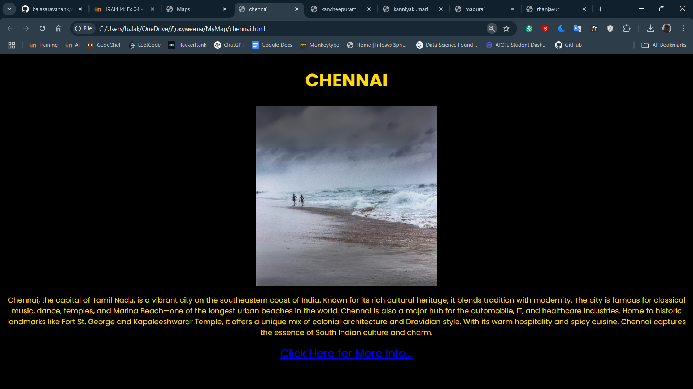
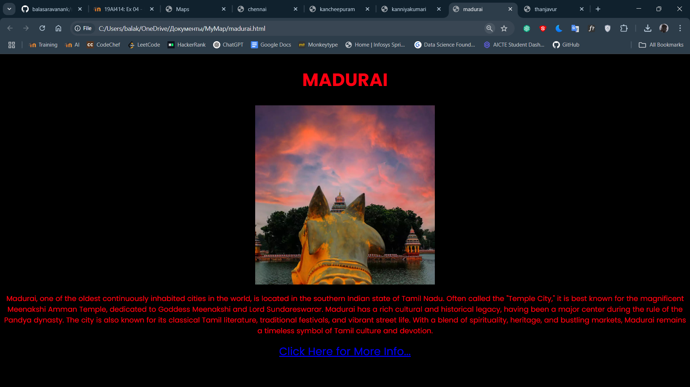
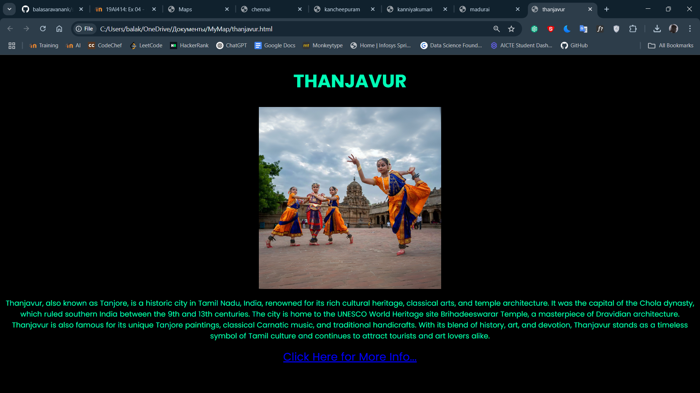
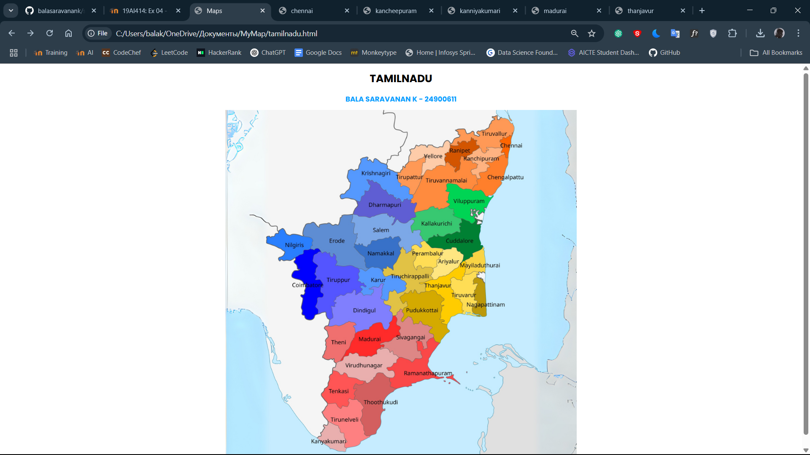
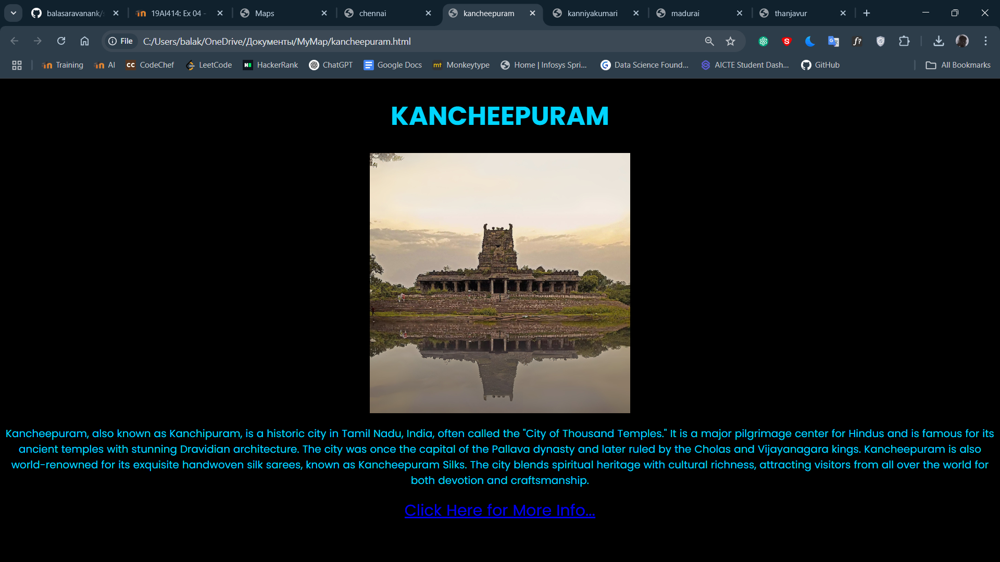
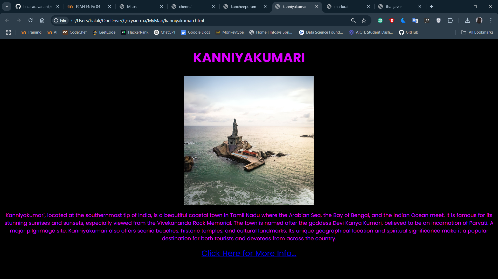

# Ex04 Places Around Me
## Date: 07-04-2025
## AIM
To develop a website to display details about the places around my house.

## DESIGN STEPS

### STEP 1
Create a Django admin interface.

### STEP 2
Download your city map from Google.

### STEP 3
Using ```<map>``` tag name the map.

### STEP 4
Create clickable regions in the image using ```<area>``` tag.

### STEP 5
Write HTML programs for all the regions identified.

### STEP 6
Execute the programs and publish them.

## CODE
```
tamilnadu.html

<!DOCTYPE html>
<head>
    <title>Maps</title>
    <style>
    h1 {
        text-align: center;
        color: rgb(0, 0, 0);
        font-family: 'Poppins';
        font-size: 30px;
    }
    h2 {
        text-align: center;
        color: rgb(4, 159, 255);
        font-family: 'Poppins';
        font-size: 20px;
    }

    </style>
</head>
<body>
    <center>
        <h1>TAMILNADU</h1>
    <h2>BALA SARAVANAN K - 24900611</h2>
    

    <map name="image-map">
        <area target="" alt="chennai" title="chennai" href="chennai.html" coords="803,98,27" shape="circle">
        <area target="" alt="kancheepuram" title="kancheepuram" href="kancheepuram.html" coords="732,143,46" shape="circle">
        <area target="" alt="madurai" title="madurai" href="madurai.html" coords="405,652,49" shape="circle">
        <area target="" alt="kanniyakumari" title="kanniyakumari" href="kanniyakumari.html" coords="257,933,267,926,275,914,287,896,295,887,306,888,315,900,331,916,335,933,339,946,337,956,335,967,324,967,307,965,285,951,277,941" shape="poly">
        <area target="" alt="thanjavur" title="thanjavur" href="thanjavur.html" coords="565,512,573,495,575,489,607,477,625,473,641,463,657,452,673,431,682,429,685,452,679,463,671,475,645,474,642,488,642,503,642,511,651,524,655,532,664,535,669,545,671,559,673,570,674,577,658,580,644,587,637,602,625,604,613,591,618,554,623,538,619,530,601,522,584,512,572,512" shape="poly">
    </map>

    </center>
    
</body>
</html>

chennai.html

<!DOCTYPE html>
<head>
    <title>chennai</title>
    <style>
        h1 {
            font-family: 'poppins';
            font-size: 50px;
            color: rgb(255, 217, 0);
        }
        p {
            font-family: 'poppins';
            font-size: 20px;
            color: rgb(255, 217, 0);
        }
        a {
            font-family: 'poppins';
            font-size: 30px;
        }

    </style>
</head>
<body bgcolor="black">
    <center>
        <h1>CHENNAI</h1>
        
        <p>
            Chennai, the capital of Tamil Nadu, is a vibrant city on the southeastern coast of India. Known for its rich cultural heritage, it blends tradition with modernity. The city is famous for classical music, dance, temples, and Marina Beach—one of the longest urban beaches in the world. Chennai is also a major hub for the automobile, IT, and healthcare industries. Home to historic landmarks like Fort St. George and Kapaleeshwarar Temple, it offers a unique mix of colonial architecture and Dravidian style. With its warm hospitality and spicy cuisine, Chennai captures the essence of South Indian culture and charm.
        </p>
        <a href="https://en.wikipedia.org/wiki/Chennai">Click Here for More Info...</a>
    </center>
    
</body>
</html>

kancheepuram.html

<!DOCTYPE html>
<head>
    <title>kancheepuram</title>
    <style>
        h1 {
            font-family: 'poppins';
            font-size: 50px;
            color: rgb(0, 213, 255);
        }
        p {
            font-family: 'poppins';
            font-size: 20px;
            color: rgb(0, 213, 255);
        }
        a {
            font-family: 'poppins';
            font-size: 30px;
        }

    </style>
</head>
<body bgcolor="black">
    <center>
        <h1>KANCHEEPURAM</h1>
        
        <P>
            Kancheepuram, also known as Kanchipuram, is a historic city in Tamil Nadu, India, often called the "City of Thousand Temples." It is a major pilgrimage center for Hindus and is famous for its ancient temples with stunning Dravidian architecture. The city was once the capital of the Pallava dynasty and later ruled by the Cholas and Vijayanagara kings. Kancheepuram is also world-renowned for its exquisite handwoven silk sarees, known as Kancheepuram Silks. The city blends spiritual heritage with cultural richness, attracting visitors from all over the world for both devotion and craftsmanship.
        </P>
        <a href="https://en.wikipedia.org/wiki/Kanchipuram">Click Here for More Info...</a>
    </center>
    
</body>
</html>

kanniyakumari.html

<!DOCTYPE html>
<head>
    <title>kanniyakumari</title>
    <style>
        h1 {
            font-family: 'poppins';
            font-size: 50px;
            color: rgb(221, 0, 255);
        }
        p {
            font-family: 'poppins';
            font-size: 20px;
            color: rgb(221, 0, 255);
        }
        a {
            font-family: 'poppins';
            font-size: 30px;
        }

    </style>
</head>
<body bgcolor="black">
    <center>
        <h1>KANNIYAKUMARI</h1>
        
        <p>
            Kanniyakumari, located at the southernmost tip of India, is a beautiful coastal town in Tamil Nadu where the Arabian Sea, the Bay of Bengal, and the Indian Ocean meet. It is famous for its stunning sunrises and sunsets, especially viewed from the Vivekananda Rock Memorial. The town is named after the goddess Devi Kanya Kumari, believed to be an incarnation of Parvati. A major pilgrimage site, Kanniyakumari also offers scenic beaches, historic temples, and cultural landmarks. Its unique geographical location and spiritual significance make it a popular destination for both tourists and devotees from across the country.
        </p>
        <a href="https://en.wikipedia.org/wiki/Kanyakumari">Click Here for More Info...</a>
    </center>
    
</body>
</html>

madurai.html

<!DOCTYPE html>
<head>
    <title>madurai</title>
    <style>
        h1 {
            font-family: 'poppins';
            font-size: 50px;
            color: rgb(255, 0, 17);
        }
        p {
            font-family: 'poppins';
            font-size: 20px;
            color: rgb(255, 0, 17);
        }
        a {
            font-family: 'poppins';
            font-size: 30px;
        }

    </style>
</head>
<body bgcolor="black">
    <center>
        <h1>MADURAI</h1>
        
        <p>
            Madurai, one of the oldest continuously inhabited cities in the world, is located in the southern Indian state of Tamil Nadu. Often called the "Temple City," it is best known for the magnificent Meenakshi Amman Temple, dedicated to Goddess Meenakshi and Lord Sundareswarar. Madurai has a rich cultural and historical legacy, having been a major center during the rule of the Pandya dynasty. The city is also known for its classical Tamil literature, traditional festivals, and vibrant street life. With a blend of spirituality, heritage, and bustling markets, Madurai remains a timeless symbol of Tamil culture and devotion.
        </p>
        <a href="https://en.wikipedia.org/wiki/Madurai">Click Here for More Info...</a>
    </center>
    
</body>
</html>

thanjavur.html

<!DOCTYPE html>
<head>
    <title>thanjavur</title>
    <style>
        h1 {
            font-family: 'poppins';
            font-size: 50px;
            color: rgb(0, 255, 183);
        }
        p {
            font-family: 'poppins';
            font-size: 20px;
            color: rgb(0, 255, 183);
        }
        a {
            font-family: 'poppins';
            font-size: 30px;
        }

    </style>
</head>
<body bgcolor="black">
    <center>
        <h1>THANJAVUR</h1>
        
        <p>
            Thanjavur, also known as Tanjore, is a historic city in Tamil Nadu, India, renowned for its rich cultural heritage, classical arts, and temple architecture. It was the capital of the Chola dynasty, which ruled southern India between the 9th and 13th centuries. The city is home to the UNESCO World Heritage site Brihadeeswarar Temple, a masterpiece of Dravidian architecture. Thanjavur is also famous for its unique Tanjore paintings, classical Carnatic music, and traditional handicrafts. With its blend of history, art, and devotion, Thanjavur stands as a timeless symbol of Tamil culture and continues to attract tourists and art lovers alike.
        </p>
        <a href="https://en.wikipedia.org/wiki/Thanjavur">Click Here for More Info...</a>
    </center>
    
</body>
</html>
```


## OUTPUT






## RESULT
The program for implementing image maps using HTML is executed successfully.
